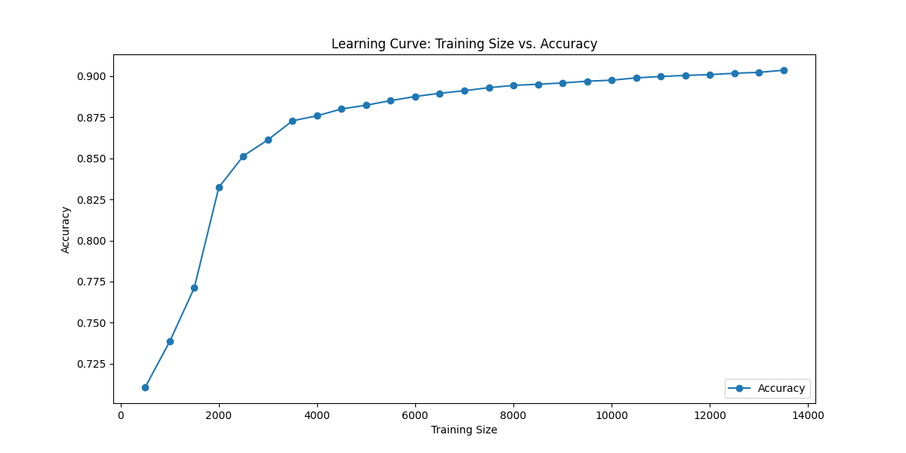

# Findings and Discussion Report

## Introduction

This project implements a Hidden Markov Model (HMM) for Part-of-Speech (POS) tagging using the German GSD Universal Dependencies dataset. The scripts evaluate the performance of the HMM and provide insights into the effect of training size on model accuracy. Results include training times, prediction accuracy, and a learning curve to demonstrate how accuracy improves with larger datasets.

## Results and Observations

### 1. Core Model Output (`hmm_core.py`):
- **Test Output:**  
  - Best sequence: `['HOT', 'HOT', 'HOT']`  
  - Probability: `0.012544`  
  - Execution time: `0.000000 seconds`  
- **Observation:**  
  The Viterbi algorithm identifies the most likely sequence of tags given a sample observation sequence. The minimal runtime reflects its efficiency for small input sequences. From the sample results we observe that the algorithm works as intended.

### 2. Model Training (`hmm_train.py`):
- **Output:**  
  - Training Time: `3.489810 seconds`  
  - Saving Parameters: `0.044575 seconds`  
  - Total Time: `3.534385 seconds`  
- **Observation:**  
  - The training process is efficient, taking less than 4 seconds for the full training dataset.
  - Model parameters are successfully saved in CSV files (`start_probs.csv`, `trans_probs.csv`, `emit_probs.csv`).

### 3. Model Evaluation (`hmm_eval.py`):
- **Output:**
  - Final Accuracy: `0.9038`
  - Common Prediction Errors:  
    - **Top 3 errors:**
      - `NOUN -> PROPN` (208 occurrences)
      - `PROPN -> NOUN` (125 occurrences)
      - `ADJ -> DET` (93 occurrences)
  - Execution Times:  
    - Training: `2.859961 seconds`
    - Test Data Loading: `0.142827 seconds`
    - Prediction: `0.688417 seconds`
    - Evaluation: `0.003128 seconds`
    - Total Time: `3.695340 seconds`
- **Observation:**  
  - The model achieves a strong accuracy of `90.38%`.  
  - Most errors involve confusion between closely related tags (e.g., `NOUN` and `PROPN`), likely due to their overlap in linguistic usage.
  - The evaluation process is efficient and scalable for the dataset size.

### 4. Learning Curve (`hmm_curve.py`):
- **Output:**  
  - Training sizes range from `500` to `13,500` sentences.
  - Accuracy improves incrementally, starting at `71.07%` (500 sentences) and peaking at `90.35%` (13,500 sentences).  
  - Total Runtime: `30.823606 seconds`.
  - **Learning Curve Plot:**
    - A smooth curve showing diminishing returns in accuracy as training size increases.  

    

- **Observation:**  
  - Accuracy improves significantly up to `4000` training sentences, where growth starts to plateau.  
  - The model achieves peak performance with the entire dataset.  
  - Indicates the HMM's dependency on large training datasets for high accuracy.

## Discussion

1. **Performance:**  
   - The HMM model demonstrates strong performance with a high accuracy of over `90%` on the test set.
   - Error analysis reveals systematic tagging issues in ambiguous contexts, such as distinguishing between `NOUN` and `PROPN`.

2. **Efficiency:**  
   - Training and evaluation processes are computationally efficient, with runtimes under 5 seconds for most tasks.
   - The `hmm_curve.py` script highlights the computational cost of scaling up training size while balancing improved accuracy.

3. **Learning Curve Insights:**  
   - The diminishing returns observed in the learning curve suggest that additional training data beyond `8000–10,000` sentences yields marginal accuracy improvements.
   - Highlights the importance of balancing dataset size and computational resources.

## Conclusions

- The HMM effectively models POS tagging for the German GSD dataset, achieving a peak accuracy of `90.38%`.
- Learning curve analysis provides insights into the model's scalability and data efficiency.
- The project successfully demonstrates the implementation of an HMM and its application to sequence prediction tasks in NLP.

## Extra Credit

- **Learning Curve Visualization:**  
  - Incremental training subsets and a detailed accuracy analysis provide a comprehensive evaluation of the model's learning behavior.
  - Implementation includes timing metrics and a polished visualization for interpreting results.
